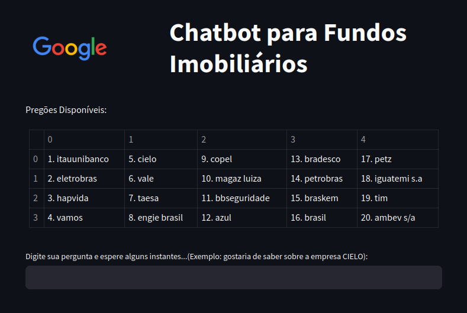

# 🤑 🏦 ChatBot para Fundos Imobiliários 💸
### Acesse o link da página do chatbot no streamlit:

https://chatbot-fi-amz5hwrvfdqu37onvlmjzz.streamlit.app/

<div style="text-align:center;">
    
</div>


<hr>

# Problema
Muitas pessoas têm vontade de investir em fundos, porém, devido à dificuldade de acessar informações confiáveis, não iniciam essa carreira. O projeto tem a finalidade de auxiliar pessoas a começar a investir em determinadas empresas com maior confiança.


<hr>

Este é um projeto de um ChatBot desenvolvido para fornecer informações sobre fundos imobiliários. Ele utiliza uma abordagem criativa e descritiva para interagir com os usuários, fornecendo detalhes sobre os fundos imobiliários listados.

## Estrutura do Projeto

```
├── files
│   ├── ativos
│   │   ├── abev3.pdf
│   │   ├── azul4.pdf
│   │   ├── ... (outros arquivos PDF)
│   │   └── vamo3.pdf
│   ├── ativos.zip
│   ├── dados_extraidos_final.csv
│   ├── output.csv
│   └── output.json
│
├── notebook-ChatBot.ipynb
├── py-chatbot.py
├── README.md
├── requirements.txt
└── streamlit_app.py
```

## Descrição dos Arquivos

- **files/**: Contém os arquivos necessários para o funcionamento do ChatBot, incluindo os PDFs com informações dos fundos imobiliários e arquivos de saída gerados pelo processamento.
- **notebook-ChatBot.ipynb**: Um notebook Python contendo o código do ChatBot.
- **py-chatbot.py**: O código Python principal que extrai dados dos PDFs, processa as informações e executa o ChatBot.
- **README.md**: Este arquivo, fornecendo informações sobre o projeto e instruções de uso.
- **requirements.txt**: Lista as dependências do projeto.
- **streamlit_app.py**: Um aplicativo Streamlit para interagir com o ChatBot através de uma interface web.

## Funcionamento do ChatBot

O ChatBot utiliza o modelo de linguagem GPT da Google para gerar respostas criativas e informativas sobre os fundos imobiliários. Ele extrai informações de arquivos PDF, processa os dados e, em seguida, responde às perguntas dos usuários com base nessas informações.

## Instruções de Uso

1. Certifique-se de ter o arquivo `.config.ini` com sua chave da API do Google no diretório raiz do projeto.
2. Execute o arquivo `py-chatbot.py` para extrair informações dos PDFs, processar os dados e iniciar o ChatBot.
3. Utilize o aplicativo Streamlit `streamlit_app.py` para interagir com o ChatBot através de uma interface web.

## Observações

- Ao executar o ChatBot, você pode fazer perguntas sobre os fundos imobiliários disponíveis.
- O ChatBot responderá de forma criativa e descritiva com base nas informações extraídas dos PDFs.
- Caso o usuário pergunte sobre outros assuntos, o ChatBot responderá que não pode fornecer informações e instruirá o usuário a perguntar sobre fundos imobiliários.

Divirta-se interagindo com o ChatBot para obter informações sobre fundos imobiliários!

Linkedin: https://www.linkedin.com/in/maryane-c-762ab620a/